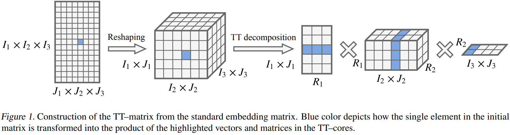
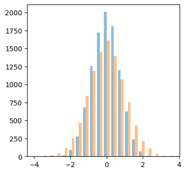

# Tensor Train Embeddings
Simple minimal implementation Tensor Train embedding in pytorch, with improved initialisation

TT–layer and TT–embedding from the paper
[Tensorized Embedding Layers](https://arxiv.org/pdf/1901.10787).<br/>
[official code](https://github.com/tt-embedding/tt-embeddings)<br/>

<div align="center">
  <div>&nbsp;</div>
  
  <div align="center">Tensor Train decomposition</div>
  <br/>
  
  <div align="center">Histogram of tt-linear weights vs normal distribution </div>
</div>

#### usage:

```
lin = TTLinear(in_features=(3,4,5,6), out_features=(2,3,4,5), rank=16)
x = torch.rand(4,7,math.prod((3,4,5,6))) # [batch, seq, in_dim]
out = lin(x) # [batch, seq, out_dim]
print(out.shape)
```
<br/>

```
emb = TTEmbedding((3,4,5,6), (2,3,4,5), rank=16)
x = torch.randint(0, math.prod((3,4,5,6)), (2, 5))
out = emb(x)
print(out.shape)
```
